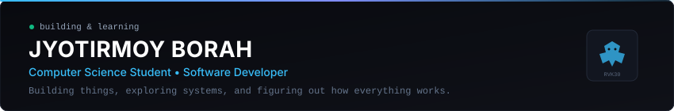
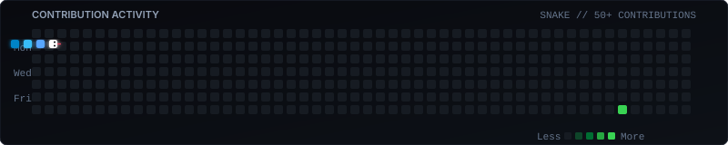

<div align="center">



<br/><br/>

[](https://github.com/Rvk30)
[](mailto:Borahjyotirmoy030@gmail.com)
[](https://linkedin.com)
[](https://github.com/Rvk30)

</div>

---

### ✦ About Me

I'm a Computer Science student interested in software development, backend systems, DevOps, and exploring AI. I enjoy building practical projects, experimenting with new technologies, and learning by actually making things.

* 🔭 **Current focus:** Building and refining [`ai-lead`](https://github.com/Rvk30/ai-lead) (lead discovery engine with browser worker pools)
* 🌱 **Exploring:** Distributed architectures, message queues, and real-time event streaming
* 💬 **Ask me about:** JavaScript, TypeScript, React/Next.js, and web automation
* ⚡ **When not coding:** Exploring game mechanics, tinkering with audio DSP, and reading tech blogs

---

### ✦ Tech Stack

```text
Languages     :: JavaScript (ES6+) • TypeScript • Python • Java • C++
Frontend      :: React • Next.js • Tailwind CSS • Vite
Backend       :: Node.js • Express • REST APIs
Databases     :: PostgreSQL • Supabase • Prisma ORM • MongoDB
Tools & Ops   :: Git • Docker • Playwright • Linux
```

---

### ✦ Featured Projects

#### [ai-lead](https://github.com/Rvk30/ai-lead)
Lead discovery and web crawling tool built with Playwright worker pools and real-time Server-Sent Events (SSE) streaming.
* **Tech:** Next.js 14 • TypeScript • Playwright • PostgreSQL • Server-Sent Events
* **Focus:** Concurrency handling with browser pools and live streaming telemetry to avoid polling.
* **Links:** [Source Code](https://github.com/Rvk30/ai-lead)

#### [DLMS](https://github.com/Rvk30/DLMS)
Digital library management system with role-based access control, JWT authentication, automated PDF license generation, and Prisma ORM data persistence.
* **Tech:** Node.js • Express • TypeScript • PostgreSQL • Prisma ORM
* **Focus:** Structured database transactions, token authentication, and document issuance.
* **Links:** [Source Code](https://github.com/Rvk30/DLMS)

#### [EViz — jb-entre](https://github.com/Rvk30/jb-entre)
EV charging station locator with interactive GIS maps, predictive wait times, and partner telemetry dashboards.
* **Tech:** React 19 • Vite • Leaflet Maps • Tailwind CSS • Recharts
* **Focus:** Interactive spatial mapping and station availability status.
* **Links:** [Source Code](https://github.com/Rvk30/jb-entre)

#### [SupaStore — fake-store](https://github.com/Rvk30/fake-store)
E-commerce web application exploring Next.js 15 App Router, React Server Actions, and Supabase Row-Level Security.
* **Tech:** Next.js 15 • TypeScript • Supabase • Tailwind CSS
* **Focus:** Server components, persistent cart state, and database-level security policies.
* **Links:** [Source Code](https://github.com/Rvk30/fake-store)

#### [VTOP Mobile — vtop-hack](https://github.com/Rvk30/vtop-hack)
Native Android utility app designed to streamline student portal logins, cache academic timetables offline, and track attendance.
* **Tech:** Kotlin • Android SDK • Gradle • Firebase
* **Focus:** Session automation and offline-first data caching.
* **Links:** [Source Code](https://github.com/Rvk30/vtop-hack)

---

### ✦ Contribution Activity

<div align="center">
  <picture>
    <source media="(prefers-color-scheme: dark)" srcset="./assets/github-contribution-grid-snake-dark.svg">
    <source media="(prefers-color-scheme: light)" srcset="./assets/github-contribution-grid-snake-dark.svg">
    
  </picture>
</div>

---

### ✦ Connect

* **Email:** [Borahjyotirmoy030@gmail.com](mailto:Borahjyotirmoy030@gmail.com)
* **GitHub:** [@Rvk30](https://github.com/Rvk30)
* **LinkedIn:** [Jyotirmoy Borah](https://linkedin.com)
