<div align="center">



<br/>

[](https://github.com/Rvk30)
[](mailto:Borahjyotirmoy030@gmail.com)
[](https://linkedin.com)

</div>

<br/>

I'm a CS student who likes building things to understand how they work. Interested in web development, backend systems, and DevOps. Currently exploring automation, containerized workflows, and whatever sounds interesting enough to stay up late for.

<br/>

### what i work with

```
languages    javascript · typescript · kotlin · python
frontend     react · next.js · tailwind css
backend      node.js · express
database     postgresql · supabase
tools        git · docker · linux
```

<br/>

### projects

**[DLMS](https://github.com/Rvk30/DLMS)** — Digital library management system with role-based access, JWT auth, and Prisma ORM.  
`typescript` `node.js` `express` `postgresql` `prisma`

**[jb-entre](https://github.com/Rvk30/jb-entre)** — EV charging station locator with interactive maps and booking UI.  
`javascript` `react` `leaflet` `tailwind css`

**[fake-store](https://github.com/Rvk30/fake-store)** — E-commerce app exploring Next.js App Router and Supabase Row-Level Security.  
`typescript` `next.js` `supabase`

**[ai-lead](https://github.com/Rvk30/ai-lead)** — Lead discovery pipeline with Docker Compose, PostgreSQL, and Redis.  
`shell` `javascript` `docker` `postgresql`

**[vtop-hack](https://github.com/Rvk30/vtop-hack)** — Android app for streamlining university portal access and timetable caching.  
`kotlin` `android sdk`

<br/>

### mini boss fight

<div align="center">
  
</div>

<br/>

<div align="center">
  <sub>currently building something · probably</sub>
</div>
