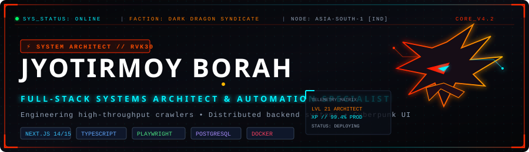
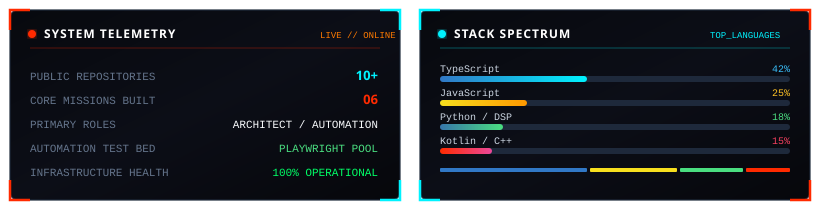
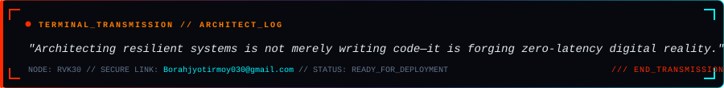

<div align="center">



<br/>

[](https://github.com/Rvk30)
[](https://github.com/Rvk30)
[](https://github.com/Rvk30?tab=repositories)
[](mailto:Borahjyotirmoy030@gmail.com)

<br/>


</div>

## ───┤ 🐉 DEVELOPER COMMAND MATRIX // ABOUT ME ├───────────────────────

```text
┌────────────────────────────────────────────────────────────────────────────┐
│ [SYSTEM_ATTRIBUTES]                                                        │
│                                                                            │
│ ⚔️ OPERATOR    : Jyotirmoy Borah                                            │
│ 🐉 CODENAME    : RVK30                                                      │
│ 🛡️ ROLE        : Full-Stack Systems Architect & Automation Specialist       │
│ ⚡ DOMAIN      : High-Throughput Web Crawlers • Resilient Distributed APIS  │
│ 🌐 BASE NODE   : India (UTC+5:30)                                           │
│ 📡 CORE STATUS : 🟢 Available for Collaboration & Mission Directives        │
└────────────────────────────────────────────────────────────────────────────┘
```

<br/>

<table>
<tr>
<td width="50%" valign="top">

### 🐉 Who I Am
Full-Stack Systems Architect and Software Engineer based in India. I engineer high-throughput web automation engines, resilient distributed backend pipelines, and modern cybernetic digital experiences with rock-solid reliability.

### ⚔️ What I Build
* **Distributed Automation Suites:** Headless Playwright browser pools with real-time SSE streaming.
* **Resilient Backends:** Scalable Node.js, Express, and PostgreSQL/Prisma architectures.
* **Spatial GIS Platforms:** Interactive telemetry mapping systems with Leaflet & Recharts.
* **Specialized Utilities:** Native Android academic tools and digital security portals.

</td>
<td width="50%" valign="top">

### 🔥 Current Focus
Scaling [`ai-lead`](https://github.com/Rvk30/ai-lead) into a high-concurrency lead discovery engine with multi-tenant browser pooling and real-time streaming enrichment.

### ⚡ What I Am Learning
* Distributed queue orchestration & microservices failover.
* Real-time event-driven data streaming pipelines.
* LLM-assisted backend workflows and automated telemetry.

### 🎮 Engineering Interests
Audio DSP algorithms, high-velocity browser automation protocols, and production-grade developer tooling.

</td>
</tr>
</table>

<div align="center">

</div>

## ───┤ ⚔️ CORE ARMORY & TECH STACK ├─────────────────────────────────────

<div align="center">

### ⚔️ Languages
[](https://developer.mozilla.org/en-US/docs/Web/JavaScript)
[](https://www.typescriptlang.org/)
[](https://www.python.org/)
[](https://www.java.com/)
[](https://isocpp.org/)
[](https://www.postgresql.org/)

### 🐉 Frontend Systems
[](https://nextjs.org/)
[](https://react.dev/)
[](https://tailwindcss.com/)
[](https://vitejs.dev/)
[](https://www.framer.com/motion/)

### 🔥 Backend & Neural Data Vaults
[](https://nodejs.org/)
[](https://expressjs.com/)
[](https://www.postgresql.org/)
[](https://supabase.com/)
[](https://www.prisma.io/)
[](https://restfulapi.net/)

### ⚡ DevOps, Cloud & Automation Heavy Weapons
[](https://playwright.dev/)
[](https://www.docker.com/)
[](https://github.com/features/actions)
[](https://vercel.com/)
[](https://git-scm.com/)

</div>

<div align="center">

</div>

## ───┤ 🎮 LEGENDARY QUEST LOG // FEATURED MISSIONS ├───────────────────

```text
[MISSION_REGISTRY] // VERIFIED PRODUCTION ARCHITECTURES
```

### 🐉 MISSION 01: [AI-Lead](https://github.com/Rvk30/ai-lead) `[TIER: LEGENDARY]`
> **Hybrid Lead Discovery & Crawler Engine**  
> **Tech Stack:** `Next.js 14` • `TypeScript` • `Playwright` • `PostgreSQL` • `Server-Sent Events (SSE)`

* **Architecture:** High-throughput browser automation engine using coordinated Playwright worker pools to execute targeted lead discovery across dynamic web targets.
* **Key Feature:** Real-time Server-Sent Events (SSE) data stream pipeline updating the telemetry dashboard without client polling overhead.
* **Action:** [**⚔️ Inspect Source Repository**](https://github.com/Rvk30/ai-lead)

---

### 🪪 MISSION 02: [DLMS](https://github.com/Rvk30/DLMS) `[TIER: EPIC]`
> **Enterprise Digital Library & License Management Portal**  
> **Tech Stack:** `Node.js` • `Express.js` • `TypeScript` • `PostgreSQL` • `Prisma ORM` • `JWT`

* **Architecture:** Robust document management and access governance portal built with secure role-based access control (RBAC) and structured database transactions.
* **Key Feature:** Cryptographic token verification with automated PDF license generation and real-time fine calculation audit logs.
* **Action:** [**⚔️ Inspect Source Repository**](https://github.com/Rvk30/DLMS)

---

### ⚡ MISSION 03: [EViz — jb-entre](https://github.com/Rvk30/jb-entre) `[TIER: EPIC]`
> **Smart EV Charging Infrastructure & Spatial GIS Platform**  
> **Tech Stack:** `React 19` • `Vite` • `Leaflet Spatial Maps` • `TailwindCSS` • `Recharts`

* **Architecture:** Real-time EV charging station locator featuring interactive GIS maps, predictive wait times, and partner telemetry dashboards.
* **Key Feature:** High-performance spatial indexing for charging node lookup paired with live analytics and slot reservation workflows.
* **Action:** [**⚔️ Inspect Source Repository**](https://github.com/Rvk30/jb-entre)

---

### 🛒 MISSION 04: [SupaStore — fake-store](https://github.com/Rvk30/fake-store) `[TIER: RARE]`
> **Full-Stack Next.js 15 & Supabase E-Commerce Engine**  
> **Tech Stack:** `Next.js 15 App Router` • `Supabase RLS` • `TypeScript` • `TailwindCSS v4`

* **Architecture:** Modern commerce engine powered by Next.js 15 Server Components and React Server Actions for zero-client-bloat performance.
* **Key Feature:** Supabase Row-Level Security (RLS) enforcing strict multi-tenant authorization rules directly at the database engine layer.
* **Action:** [**⚔️ Inspect Source Repository**](https://github.com/Rvk30/fake-store)

---

### 📱 MISSION 05: [VTOP Mobile — vtop-hack](https://github.com/Rvk30/vtop-hack) `[TIER: RARE]`
> **Native Android Academic Portal & Automation App**  
> **Tech Stack:** `Kotlin` • `Android SDK` • `Gradle` • `Firebase Crashlytics`

* **Architecture:** Lightweight native Android client engineered to eliminate student workflow friction through intelligent portal automation.
* **Key Feature:** Automated session handling, local offline timetable caching, and proactive attendance tracking telemetry.
* **Action:** [**⚔️ Inspect Source Repository**](https://github.com/Rvk30/vtop-hack)

---

### 🎵 MISSION 06: [SonoDS](https://github.com/niksxox/SonoDS---Laphing-Buddha-) `[TIER: RARE]`
> **AI Audio DSP & Frequency Equalization Engine**  
> **Tech Stack:** `C++` • `Python` • `Flask` • `Audio DSP Rules` • `LLM Integration`

* **Architecture:** Open-source audio processing suite engineered for spectral equalization, stereo field phase checks, and mono-compatibility audits.
* **Key Feature:** Automated frequency spectrum analysis algorithms paired with heuristic audio mixing rules for music producers.
* **Action:** [**⚔️ Inspect Source Repository**](https://github.com/niksxox/SonoDS---Laphing-Buddha-)

<div align="center">

</div>

## ───┤ 🐉 SKILL TREE & ATTRIBUTE MATRIX ├───────────────────────────────

```text
[DRAGON_SKILL_TREE]
┣━━ 🐉 DISTRIBUTED CRAWLERS & AUTOMATION : [███████████████████ ] 95%
┣━━ ⚡ BACKEND ARCHITECTURE & DATABASES   : [██████████████████  ] 90%
┣━━ 🛡️ FULL-STACK WEB & NEXT.JS 14/15    : [█████████████████   ] 88%
┣━━ ☁️ DEVOPS, DOCKER & CLOUD WORKFLOWS  : [████████████████    ] 80%
┗━━ 📱 MOBILE UTILITIES & AUDIO DSP      : [███████████████     ] 75%
```

<div align="center">

</div>

## ───┤ 📊 CYBERPUNK HUD TELEMETRY ├─────────────────────────────────────

<div align="center">



<br/><br/>


</div>

<div align="center">

</div>

## ───┤ 📡 SECURE TRANSMISSION // CONTACT NODE ├─────────────────────────

<div align="center">



<br/><br/>

[](https://github.com/Rvk30)
[](mailto:Borahjyotirmoy030@gmail.com)
[](https://linkedin.com)
[](https://github.com/Rvk30)

</div>
