<div align="center">



<br/>
<br/>

<a href="https://github.com/Rvk30"></a>
&nbsp;&nbsp;
<a href="mailto:Borahjyotirmoy030@gmail.com"></a>
&nbsp;&nbsp;
<a href="https://linkedin.com"></a>

</div>

<br/>

I'm a CS student who likes building things to understand how they work. Interested in web development, backend systems, and DevOps. Currently exploring automation, containerized workflows, and software architecture.

<br/>

### what i work with

```
languages    javascript · typescript · kotlin · python
frontend     react · next.js · tailwind css
backend      node.js · express
database     postgresql · supabase
tools        git · docker · linux
```

<br/>

### projects

**[DLMS](https://github.com/Rvk30/DLMS)** — Digital library management system with role-based access, JWT auth, and Prisma ORM.  
`typescript` `node.js` `express` `postgresql` `prisma`

**[jb-entre](https://github.com/Rvk30/jb-entre)** — EV charging station locator with interactive maps and booking UI.  
`javascript` `react` `leaflet` `tailwind css`

**[fake-store](https://github.com/Rvk30/fake-store)** — E-commerce store exploring Next.js App Router and Supabase Row-Level Security.  
`typescript` `next.js` `supabase`

**[ai-lead](https://github.com/Rvk30/ai-lead)** — Lead discovery pipeline with Docker Compose, PostgreSQL, and Redis.  
`shell` `javascript` `docker` `postgresql`

**[vtop-hack](https://github.com/Rvk30/vtop-hack)** — Android utility for university timetable caching and portal integration.  
`kotlin` `android sdk`

<br/>

### mini boss fight

<div align="center">
  
</div>

<br/>

<div align="center">
  <sub>currently building something · probably</sub>
</div>
